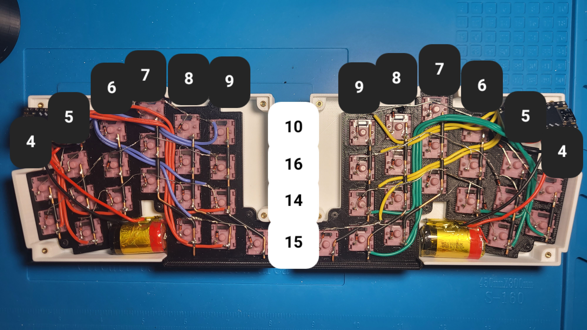

# Greg
Mostly inspired by GEIST's [TOTEM](https://github.com/GEIGEIGEIST/TOTEM) and [KLOR](https://github.com/GEIGEIGEIST/KLOR/tree/main) keyboards, except I wanted to handwire them. It's a real bitch to assemble and I did NOT follow the best CAD practices lol good luck trying to modify the freecad file.

## BOM
| Name | Qt | Link |
| :--- | :---: | :--- |
| Cases | 02 | [mirror for left half](/keebs/greg/case/) |
| 6mm M2 Screws | 18 | [ali](https://www.aliexpress.us/item/3256802343690897.html) |
| M2 Heat Set Inserts | 18 | [ali](https://www.aliexpress.us/item/3256803396040989.html) (get 3.2mm od) |
| 1N4148 Diodes | 40 | [ali](https://www.aliexpress.us/item/2255800939822415.html) |
| 1208YD Power Buttons | 02 | [ali](https://www.aliexpress.us/item/3256801267126259.html) |
| Nice!nano v2s or Clones | 02 | [nice!nano](https://nicekeyboards.com/nice-nano/#find-a-store) (not sure if these fit, you might have to mod the bottom of the case), [clones](https://www.aliexpress.us/item/3256806085566324.html) |
| Switches & Caps| 40  | duh |
| Lipos | 02 | There's like 3 pockets where you can fit some |
| 6mm Rubber Feet | 8 | [ali](https://www.aliexpress.us/item/3256805668157435.html) (or use whatever you have and mod the bottom of the case) |

## Build Guide
Wire the matrix like this (you should probably use solid copper for the rows instead of diode legs like I did):

Since we're looking at the back, red and blue wires are the right half, green and yellow are the left. The numbers are Arduino labels.

Solder the power button to the positive wire and B+ or RAW pins, insert the heat set inserts, put the rubber feet in, then screw everything together.

## Firmware
[Instructions are here.](https://github.com/tangyboi3/zmk-keyboard-greg)
